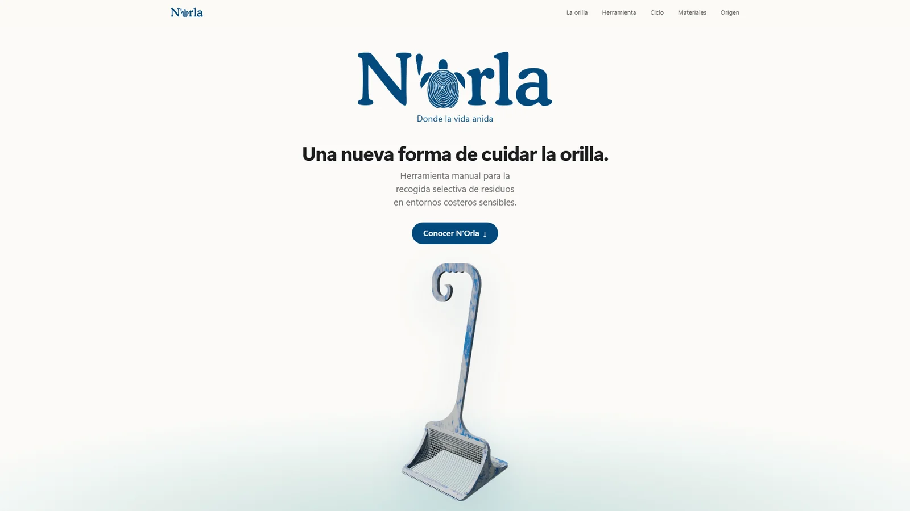

# N’Orla — Donde la vida anida



**Demo en producción:** https://diegoextremiana.github.io/Norla/

Sitio web de presentación de **N’Orla**, el Trabajo de Fin de Grado en Diseño de Producto de **Diana Extremiana**. El proyecto define una herramienta manual para la recogida selectiva de residuos en entornos costeros sensibles; la web es la pieza digital que lo presenta ante el tribunal y el público.

| | |
| --- | --- |
| **Cliente** | Diana Extremiana, alumna del Grado en Diseño de Producto |
| **Encargo** | Diseño de interacción y desarrollo front-end del sitio de presentación del TFG |
| **Desarrollo** | Diego Extremiana |
| **Stack** | HTML, CSS y JavaScript nativos (módulos ES), sin dependencias |
| **Despliegue** | GitHub Pages |

## El producto

N’Orla responde a una problemática observada en las costas de Cabo Verde, donde la acumulación de residuos afecta a las zonas intermareales y a las playas de anidación de tortugas marinas. Allí la limpieza mecanizada no es viable, porque altera la arena y pone en riesgo la fauna.

La herramienta combina dos sistemas en una sola pieza:

- **Cribar:** recoge y separa los residuos de la superficie de la arena sin alterar el sustrato.
- **Filtrar:** retiene los residuos de la superficie del agua con lana como material natural de retención.

El diseño sigue una lógica de economía circular: el plástico recogido en las playas se transforma en materia prima para fabricar nuevos componentes de la propia herramienta.

## El encargo

El objetivo era trasladar a la web el mismo cuidado que el proyecto de producto, con tres requisitos:

1. **Contar el proyecto como un relato**, de la problemática al producto y de vuelta a la playa, en lugar de una ficha técnica.
2. **Explicar visualmente cómo funciona la herramienta** a partir de los renders del proyecto: despiece, modos de uso y montaje.
3. **Respetar la identidad visual del TFG**: el símbolo de la huella dactilar con forma de tortuga, la paleta azul y la fotografía de campo.

## La solución

Una página única construida como una pila de paneles que avanzan con el scroll. Cada sección es una escena con su propia animación:

| Sección | Contenido e interacción |
| --- | --- |
| Portada | Logotipo, claim y render del producto, que se separan al iniciar el recorrido |
| 01 La orilla | Fotografía a sangre y una frase que se ilumina palabra a palabra |
| 02 Herramienta | Despiece animado a partir de los renders: piezas, modo cribar, modo filtrar y montaje final |
| 03 Diseñada para no invadir | Por qué una herramienta manual frente a la limpieza mecanizada |
| 04 Del residuo al recurso | Diagrama circular del ciclo playa → residuo → recogida → transformación → N’Orla |
| 05 Materiales | Plástico recuperado y lana, con texturas generadas con filtros SVG |
| 06 Para quién | Voluntarios, ONG, equipos de limpieza y comunidades locales |
| 07 El origen | Cabo Verde, la pregunta que guía el proyecto y la identidad visual |

## Desarrollo técnico

Desarrollado sin frameworks ni librerías de animación, para tener un control total sobre el movimiento y no depender de un paso de build.

- **Arquitectura modular:** `js/core` contiene las utilidades compartidas y `js/modules` una escena por sección, cada una con su hoja de estilos en `css/sections`.
- **Un único bucle `requestAnimationFrame`** para todas las animaciones ligadas al scroll, que solo se ejecuta mientras hay movimiento.
- **Geometría calculada a partir de la posición del scroll**, sin lecturas de layout (`getBoundingClientRect`) en cada frame, y escrituras al DOM solo cuando un valor cambia.
- **Muelles críticamente amortiguados** que suavizan el progreso de cada escena y se pueden interrumpir en cualquier momento.
- **Paneles `sticky` con efecto de pila:** el panel inferior retrocede mientras el siguiente sube.
- **Gráficos generados por código:** los anillos inspirados en la huella se dibujan en SVG con curvas Catmull-Rom y se animan con `stroke-dashoffset`.

### Accesibilidad y rendimiento

- Respeta `prefers-reduced-motion`: si el usuario lo tiene activado, se desactivan las animaciones ligadas al scroll.
- HTML semántico, secciones etiquetadas, textos alternativos en todas las imágenes de contenido y menú accesible en móvil.
- Navegación por anclas adaptada a los paneles fijos.
- Imágenes en WebP con dimensiones declaradas, carga diferida y precarga de la imagen principal.
- Diseño adaptable de escritorio a móvil.

## Estructura

```
├── index.html
├── css/
│   ├── base.css, layout.css, components.css
│   └── sections/        estilos de cada sección
├── js/
│   ├── main.js          punto de entrada
│   ├── core/            bucle, layout, matemáticas y muelles
│   └── modules/         una escena por sección
├── assets/img/          imágenes optimizadas para la web
└── tests/
    ├── unit/            node:test sobre los módulos de js/core y la pila
    └── e2e/             Playwright en iPhone (WebKit), Android, escritorio y movimiento reducido
```

## Ejecución en local

No requiere instalación. Al usar módulos ES, la página debe servirse por HTTP:

```bash
npx serve .
# o
python -m http.server
```

## Tests

El sitio no tiene dependencias; Playwright solo se instala para los tests.

```bash
npm install
npx playwright install chromium webkit
npm test              # unitarios + end-to-end
npm run test:unit     # solo unitarios (sin dependencias)
```

Los end-to-end recorren la página entera y comprueban, entre otras cosas, que no haya errores ni recursos rotos, que la pila de paneles nunca acumule más de tres capas en pantalla ni pinte una sección en el orden equivocado, que no haya scroll horizontal y que las escenas, la navegación y el modo de movimiento reducido funcionen.

## Créditos

- **Proyecto de producto (TFG en Diseño de Producto):** Diana Extremiana
- **Diseño de interacción y desarrollo web:** Diego Extremiana
- **Fotografías de campo:** Cabo Verde Natura 2000

Los renders, la identidad visual y el concepto de producto son propiedad de su autora.
